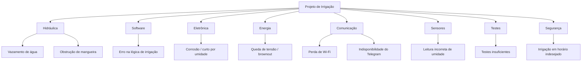

# Análise de Riscos

## Introdução

A análise de riscos é essencial em projetos de sistemas embarcados que envolvem **água, eletrônica e automação**, como é o caso do controlador de irrigação inteligente com ESP32.  

O sistema proposto integra sensores, bomba de água, fonte de energia e comunicação em rede, de modo que falhas podem decorrer tanto de fatores técnicos quanto ambientais (vazamentos, falta de água, perda de Wi‑Fi, etc.). Este documento organiza os principais riscos, suas causas e estratégias de mitigação.

## Metodologia

A análise segue uma abordagem qualitativa estruturada:

1. Identificação de riscos a partir da arquitetura e dos requisitos;
2. Classificação por categoria (software, eletrônica, hidráulica, energia, comunicação);
3. Avaliação de impacto e probabilidade;
4. Definição de ações de mitigação;
5. Planejamento de contingências.

## Aplicação no Projeto

O sistema de irrigação deve:

- ler sensores de solo, ar e nível;
- acionar uma bomba e conduzir água pelo circuito hidráulico;
- operar de forma automática e manual;
- expor informações por Telegram e web.

Falhas em qualquer subsistema podem gerar:

- irrigação inadequada (falta ou excesso de água);
- danos à bomba ou fonte;
- risco à eletrônica por contato com água;
- perda de monitoramento.

---

## Diagrama Geral de Riscos

---

## Critérios de Classificação

### Impacto

- **Alto:** compromete diretamente o funcionamento ou causa danos ao sistema.
- **Médio:** afeta desempenho, mas permite recuperação.
- **Baixo:** impacto limitado.

### Probabilidade

- **Alta:** provável sem mitigação.
- **Média:** possível.
- **Baixa:** pouco provável.

---

## Tabela de Riscos

| ID  | Categoria    | Risco                           | Descrição                                                   | Prob. | Impacto | Mitigação                                               | Contingência                                    |
| --- | ------------ | ------------------------------- | ----------------------------------------------------------- | ----- | ------- | ------------------------------------------------------- | ----------------------------------------------- |
| R01 | Planejamento | Atraso na integração            | Atraso na integração firmware + hidráulica + eletrônica     | Média | Alto    | Divisão em etapas (sensores, bomba, comunicação)        | Reduzir escopo de telemetria em primeira versão |
| R02 | Hidráulica   | Vazamento de água               | Mangueiras mal fixadas ou reservatório mal vedado          | Média | Alto    | Uso de abraçadeiras, testes de estanqueidade           | Reposicionar mangueiras e reforçar conexões     |
| R03 | Hidráulica   | Obstrução da mangueira          | Entupimento por sujeira ou dobra acentuada                 | Média | Médio   | Filtrar água, evitar curvas fechadas, inspeções visuais | Limpeza periódica e substituição se necessário  |
| R04 | Sensores     | Leitura incorreta de umidade    | Sensor de solo com ruído ou má calibração                  | Alta  | Alto    | Calibração, filtragem média/móvel                      | Desativar modo automático até recalibração      |
| R05 | Sensores     | Falha no sensor de nível        | Boia travada ou desconectada                               | Média | Alto    | Fixação mecânica adequada, testes frequentes            | Bloquear irrigação automática por segurança     |
| R06 | Eletrônica   | Contato de água na placa        | Respingo atingindo ESP32 ou driver                         | Baixa | Alto    | Caixa protegida, afastar eletrônica da área molhada     | Desligar sistema e secar/inspecionar componentes|
| R07 | Energia      | Queda de tensão (brownout)      | Fonte insuficiente para bomba + ESP32                      | Média | Alto    | Dimensionar fonte, monitorar tensão no firmware        | Reiniciar sistema e reduzir tempo de irrigação  |
| R08 | Energia      | Superaquecimento da bomba/driver| Acionamento prolongado ou ventilaçao insuficiente          | Baixa | Alto    | Limitar tempo máximo de irrigação por ciclo            | Trocar bomba/driver e reduzir duty cycle        |
| R09 | Software     | Lógica de irrigação errada      | Threshold mal configurado, irrigação em excesso ou falta   | Média | Alto    | Testes com cenários de solo seco/úmido, revisão de lógica | Ajustar thresholds e desativar modo AUTO        |
| R10 | Comunicação  | Perda de Wi‑Fi                  | Acesso à web e Telegram indisponíveis                      | Alta  | Médio   | Reconexão automática de Wi‑Fi                          | Operar em modo local sem telemetria remota      |
| R11 | Comunicação  | Indisponibilidade do Telegram   | API fora do ar ou bloqueios temporários                    | Média | Baixo   | Garantir funcionamento offline do sistema               | Focar em interface web/local                    |
| R12 | Testes       | Testes insuficientes            | Não validar casos de solo seco, reservatório vazio, erros  | Média | Alto    | Roteiros de teste para cada subsistema                  | Repetir testes e ajustar antes da demonstração  |
| R13 | Segurança    | Irrigação em horário indesejado | Execução automática durante uso do ambiente pelo usuário   | Baixa | Médio   | Documentar horários de operação, permitir pausa manual | Botão ou comando para desativar modo AUTO       |
| R14 | Segurança    | Curto-circuito                  | Falha elétrica em fiação ou driver                         | Baixa | Alto    | Fusível ou proteção, inspeção visual da fiação         | Desligar sistema e revisar circuito             |
| R15 | Manutenção   | Conexões soltas                 | Jumpers e terminais se soltando com o tempo                | Média | Médio   | Uso de conectores com trava, organização de cabos      | Revisões periódicas e reaperto                  |
| R16 | Firmware     | Travamento da ESP32             | Bug ou overflow em código                                  | Média | Alto    | Watchdog, tratamento de erros                           | Reset automático e retomada em modo seguro      |
| R17 | Histórico    | Perda de eventos de irrigação   | Falha ao registrar histórico na memória                    | Média | Baixo   | Verificar rotinas de escrita, limitar tamanho do buffer| Recalcular estatísticas a partir de novo período|
| R18 | Configuração | Threshold mal definido          | Usuário configura valor inadequado                         | Média | Médio   | Validação de faixa de valores na interface             | Restaurar configuração padrão                   |

---

## Discussão dos Principais Riscos

### Sensores e decisão de irrigação
Leituras incorretas de umidade do solo ou nível podem levar o sistema a irrigar em situações erradas (solo já úmido, reservatório vazio), gerando desperdício de água ou dano a componentes.

### Integração hidráulica–eletrônica
Vazamentos ou respingos próximos à eletrônica são críticos, pois podem causar curtos ou corrosão, exigindo atenção especial ao layout físico.

### Energia e brownout
Dimensionamento inadequado da fonte pode levar à queda de tensão durante o acionamento da bomba, travando ou reiniciando a ESP32.

### Comunicação e telemetria
Perda de Wi‑Fi ou do serviço de Telegram não deve impedir o funcionamento básico; o sistema precisa operar em modo local, evitando dependência total da nuvem.  

---

## Estratégia Geral de Resposta

- Testes incrementais por subsistema (sensores, bomba, firmware, comunicação);
- Validação em bancada antes de integração completa;
- Monitoramento de tensão e estado dos sensores em tempo real;
- Implementação de modos de segurança (bloqueio de irrigação em condições anômalas);
- Documentação clara de configuração e uso (thresholds, modos).

## Diretrizes de Implementação no Firmware

- Evitar blocos de código bloqueantes (`delay()` excessivo) para não prejudicar leitura de sensores;
- Utilizar temporização baseada em `millis()` ou tarefas (FreeRTOS);
- Implementar máquina de estados (FSM) para controlar fluxo: IDLE, LEITURA, DECISÃO, IRRIGAÇÃO, ERRO;
- Registrar logs básicos via Serial para depuração;
- Implementar watchdog para recuperação automática de travamentos.

## Conclusão

A análise de riscos permite antecipar problemas e orientar o desenvolvimento do sistema de irrigação com ESP32 de forma mais segura e robusta. Ao considerar riscos hidráulicos, elétricos, de firmware e de comunicação, o projeto ganha maturidade e confiabilidade.  

## Referências

* Documentação ESP32 (Espressif).
* Artigos de smart irrigation com ESP32 e IoT.  
* PMBOK Guide – Project Management Institute.

## Histórico de Versões

**Tabela 1** - Histórico de versões.

| Versão | Descrição | Autor(es) | Data | Revisor | Data de revisão |
| :----: | :-------: | :-------: | :--: | :-----: | :-------------: |
|  1.0   | Criação do documento (análise de riscos do sistema de irrigação) | [Gabriel Santos Monteiro](https://github.com/GabrielSMonteiro) | 30/06/2026 |  |  |