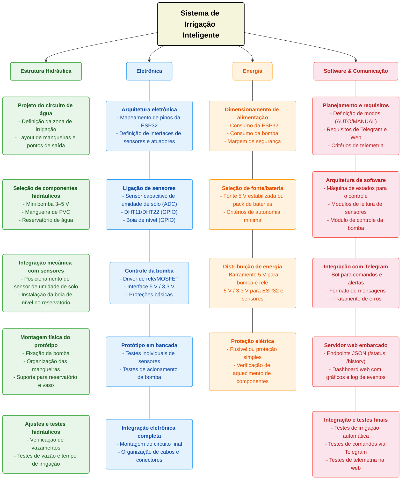

# Estrutura Analítica do Projeto (EAP)

## Introdução

Este documento apresenta a Estrutura Analítica do Projeto (EAP) para o desenvolvimento de um **controlador de irrigação inteligente com ESP32**, organizando as principais atividades necessárias para sua execução.

A EAP divide o projeto em quatro áreas principais — **Estrutura Hidráulica**, **Eletrônica**, **Energia** e **Software & Comunicação** — permitindo uma visão clara das etapas, melhor planejamento e acompanhamento das atividades.

Essa organização contribui para o controle do escopo, a integração entre os subsistemas e a condução eficiente do projeto até sua entrega prática na disciplina.

---

## Histórico de Versões

**Tabela 1** - Histórico de versões.

| Versão | Descrição | Autor(es) | Data |
| :----: | :-------: | :-------: | :--: |
|  1.0   | Criação do documento (EAP do sistema de irrigação) | [Gabriel Santos Monteiro](https://github.com/GabrielSMonteiro) | 30/06/2026 |