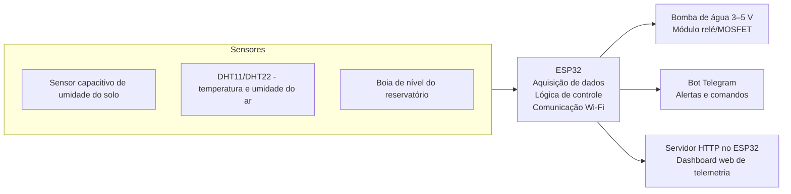
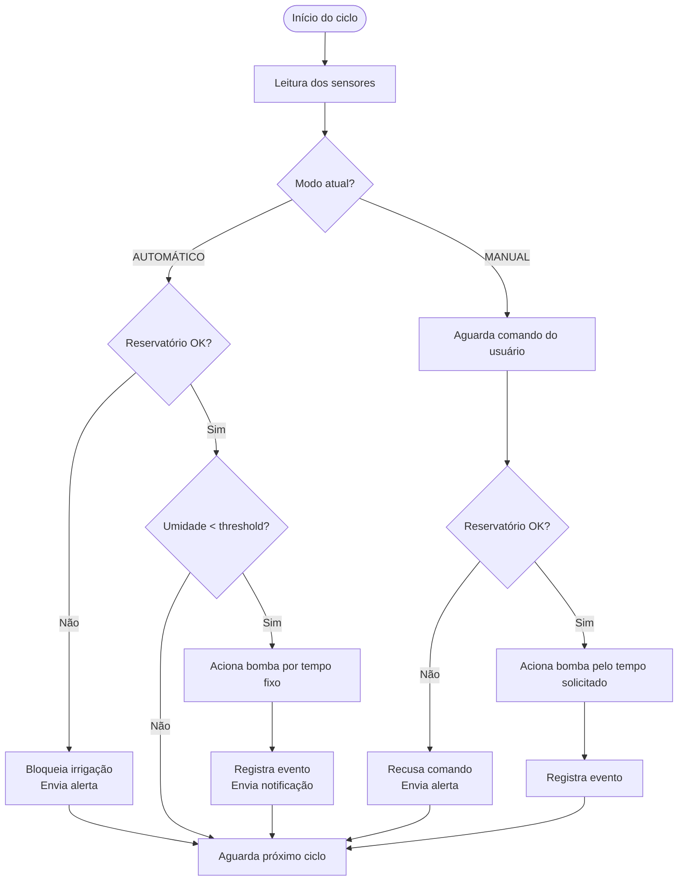
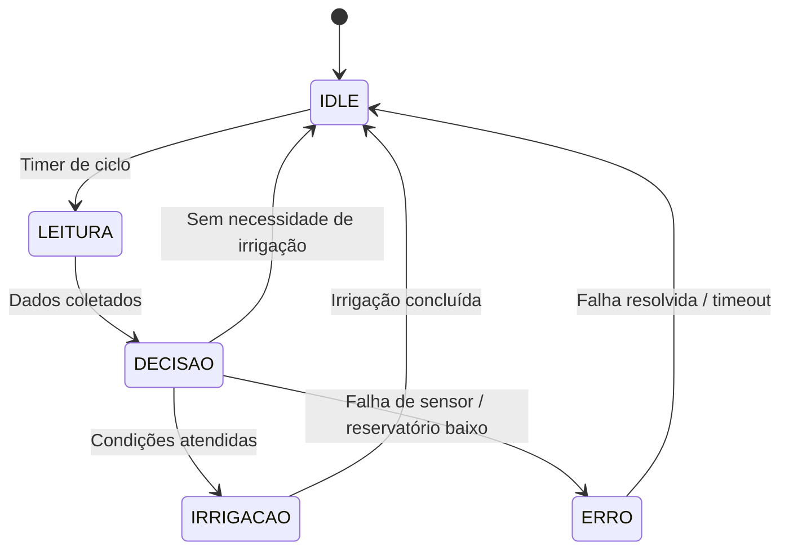

# Funcionamento Técnico do Sistema

## Introdução

Este documento descreve o funcionamento técnico do **Controlador de Irrigação Inteligente com ESP32**, detalhando a arquitetura geral do sistema, os fluxos de dados entre os subsistemas e a lógica de operação que governa a irrigação automática e manual.

O objetivo é fornecer uma visão consolidada de como os componentes de hardware (sensores, atuadores, microcontrolador) se integram com as camadas de software (firmware, comunicação, interface) para entregar as funcionalidades descritas nos [requisitos do projeto](requisitos.md).

---

## Diagrama Conceitual do Sistema

O diagrama abaixo apresenta a visão geral da arquitetura, mostrando os três blocos principais — **Sensores**, **ESP32** e **Saídas** — e os fluxos de dados entre eles.



---

## Fluxo de Operação

O sistema opera em um ciclo contínuo dividido em quatro etapas principais, executadas periodicamente (a cada 30–60 segundos):

### 1. Aquisição de Dados

O ESP32 lê os três sensores conectados:

| Sensor | Interface | Dado obtido |
|---|---|---|
| Sensor capacitivo de umidade do solo | ADC (analógico) | Umidade do solo (0–100%) |
| DHT11 / DHT22 | GPIO (digital) | Temperatura (°C) e umidade relativa do ar (%) |
| Boia de nível | GPIO (`INPUT_PULLUP`) | Estado do reservatório (OK / Baixo) |

As leituras do sensor de umidade do solo passam por uma etapa de filtragem (média móvel) para eliminar ruídos e variações bruscas, garantindo decisões de irrigação mais confiáveis.

### 2. Decisão de Irrigação

Com os dados coletados, o ESP32 executa a lógica de decisão conforme o modo de operação ativo:



**Regras de segurança aplicadas em ambos os modos:**

- A bomba nunca é acionada se o reservatório estiver com nível baixo.
- Em caso de leituras consecutivas inválidas dos sensores, o modo automático é suspenso até recalibração.
- Um tempo máximo de irrigação por ciclo é imposto para evitar superaquecimento da bomba.
- Histerese é aplicada no modo automático para evitar acionamentos repetidos (intervalo mínimo entre irrigações).

### 3. Acionamento do Atuador

O acionamento da bomba de água é feito de forma indireta, através de um módulo relé ou driver MOSFET:

```
ESP32 (GPIO 3,3 V)  →  Módulo Relé/MOSFET  →  Bomba 5 V DC
```

O GPIO do ESP32 envia um sinal de controle ao módulo relé, que comuta a alimentação de 5 V para a bomba. A bomba nunca é alimentada diretamente pelo GPIO para proteção do microcontrolador.

### 4. Comunicação e Telemetria

Após cada ciclo de leitura e decisão, o ESP32 atualiza os canais de comunicação:

**Bot no Telegram:**
- Envia notificações automáticas em eventos relevantes (solo seco, irrigação concluída, reservatório baixo).
- Responde a comandos do usuário (`/status`, `/modo_auto`, `/modo_manual`, `/regar_20s`).

**Dashboard Web (servidor HTTP embarcado):**
- Atualiza os endpoints da API REST (`/api/status`, `/api/history`) com os dados mais recentes.
- A página web consulta esses endpoints periodicamente para exibir gráficos e indicadores em tempo real.

---

## Diagrama de Estados do Sistema

O firmware do ESP32 é organizado como uma máquina de estados finita (FSM) com os seguintes estados:



| Estado | Descrição |
|---|---|
| **IDLE** | Aguarda o próximo ciclo de leitura. O sistema monitora comandos do Telegram e requisições web. |
| **LEITURA** | Executa a leitura de todos os sensores e aplica filtragem. |
| **DECISÃO** | Avalia as condições de irrigação conforme o modo ativo e as regras de segurança. |
| **IRRIGAÇÃO** | Aciona a bomba pelo tempo determinado, registra o evento e envia notificações. |
| **ERRO** | Estado de falha: bloqueia irrigação automática, registra o erro e tenta recuperação. |

---

## Distribuição de Energia

O sistema utiliza uma fonte de 5 V estabilizada que alimenta dois barramentos:

| Barramento | Componentes | Tensão |
|---|---|---|
| **Potência** | Bomba de água, módulo relé | 5 V |
| **Sinal** | ESP32, sensores (umidade, DHT, boia) | 3,3 V (regulador interno do ESP32) |

A separação entre os barramentos de potência e sinal minimiza interferências eletromagnéticas causadas pelo acionamento da bomba e do relé, prevenindo resets indesejados do ESP32.

---

## Histórico de Versões

<font size="3"><p style="text-align: left">**Tabela 1** - Histórico de versões.</p></font>

| Versão | Descrição | Autor(es) | Data | Revisor | Data de revisão |
| :----: | :-------: | :-------: | :--: | :-----: | :-------------: |
|  1.0   | Criação do documento de funcionamento técnico | [Gabriel Santos Monteiro](https://github.com/GabrielSMonteiro) | 30/06/2026 |  |  |